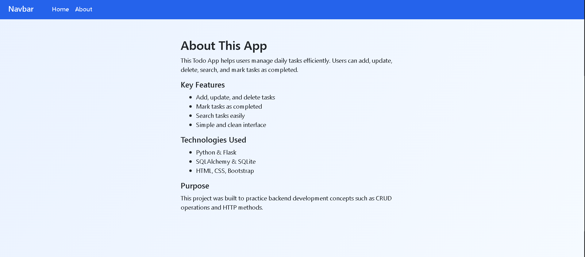

# Flask To-Do App

A simple and responsive To-Do List web application built with Python Flask. This project demonstrates the core concepts of Flask by allowing users to create, update, search, and manage tasks using a clean and user-friendly interface.

## Live Demo

**Live Application:** https://flask-todo-app-8rl6.onrender.com

## Repository

**GitHub Repository:** https://github.com/MohammaddAnas/flask-todo-app

## Screenshots

### Home Page

[Home Page](screenshots/home.png)

### About Page



## Features

* Add new tasks
* Update existing tasks
* Delete tasks
* View all tasks
* Search tasks by title or description
* Mark tasks as completed or incomplete
* Store task creation date and time
* Responsive user interface
* Dynamic pages using Jinja2 templates

## Technologies Used

### Backend

* Python
* Flask
* Flask-SQLAlchemy
* SQLite
* Datetime

### Frontend

* HTML
* CSS
* JavaScript

### Flask Concepts

* Routing
* GET and POST requests
* Jinja2 template inheritance
* SQLAlchemy ORM
* CRUD operations

## Skills Demonstrated

* Flask Web Development
* SQLAlchemy ORM
* CRUD Operations
* Database Management
* Template Inheritance
* Responsive Web Design
* Git & GitHub

## Project Structure

```text
Todo-App/
│── app.py
│── requirements.txt
│── README.md
│── .gitignore
│
├── screenshots/
│   ├── home.png
│   └── about.png
│
├── templates/
│   ├── base.html
│   ├── index.html
│   ├── update.html
│   └── about.html
│
├── static/
│   ├── css/
│   │   └── style.css
│   └── js/
│       └── test.js
```

## Installation

1. Clone the repository.

```bash
git clone https://github.com/MohammaddAnas/flask-todo-app.git
```

2. Navigate to the project directory.

```bash
cd flask-todo-app
```

3. Install the required dependencies.

```bash
pip install -r requirements.txt
```

4. Run the application.

```bash
python app.py
```

5. Open your browser and visit:

```text
http://127.0.0.1:5000/
```

## Future Improvements

* User authentication
* Task categories
* Task priorities
* Due dates
* Dark mode

## Author

**Muhammad Anas**

